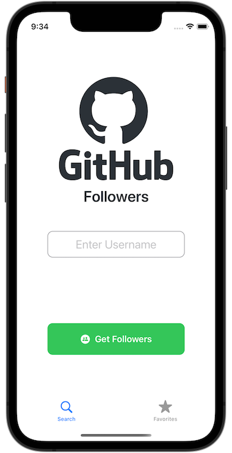
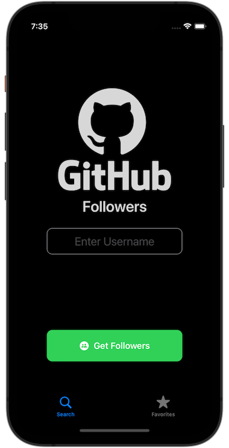

# GitHubFollowMe (🚧 in progress...)
This is my latest (Spring/Summer 2022) portfolio App and also an example how a Take-Me-Home Project for a iOS Developer position* can look like.
(*Probably a Middle iOS Developer position)

    
    
    
    
    

---

* [Tech Stack](#tech-stack)
* [Device Requirements](#device-requirements)
* [Common Take-Me-Home Project Tasks](#common-take-me-home-project-tasks)

---

## Tech Stack 🕹
- Swift 5.6.1
- [SwiftUI](https://developer.apple.com/documentation/swiftui) for iOS15+
- Xcode 13.4.1
- [Codable](https://developer.apple.com/documentation/swift/codable)
- [Combine](https://www.avanderlee.com/swift/combine/)

## Libraries 📚
🚫 No 3rd Party Libraries in use 

## Device Requirements 📱
This App runs on an iPhone with iOS 15+

## Common Take-Me-Home Project Tasks 📝
- Do some small design
- Make a network call to an API
- Retrieve the data and parse the JSON (e.g. from a GraphQL query)
- Display the data in a pretty UI
- Apply some design patterns
- Add some Unit-Tests
- Write a great README (like this one here 😁)

### Beyond the scope 🌅
The following things can/will impress, but are in most cases way beyond the scope of a take me home project:
- Error handling -> add custom alerts
- Error handling -> handle each possible HTTPURLResponse code
- Logging ([OSLog](https://developer.apple.com/documentation/oslog))
- [SwiftLint](https://github.com/realm/SwiftLint)
- Caching of images (which have to be downloaded)
- An extensive suite of Unit-Tests
- UI-Tests

### What interviewers might be looking for 🎤
- The given time frame for building such an App, is not what matters most
- What are the persons's first steps for building the app?
- Are there any design drawings present?
- App-Icon? (Might be a nice final touch and give you some extra creativity points)
- Does the project include a README (with some screens of the App)?
- How does the UI look like? -> Apple design guidelines
- Are the given tasks completed?
- Does the App actually do what it is supposed to do?
- Design Patterns?
- Upload in TestFlight?
- No crashes (handling of optionals?)
- Testing: Unit-Tests? How well are the test activities documented? Real-Device Testing?
- Is [Automatic Reference Counting](https://docs.swift.org/swift-book/LanguageGuide/AutomaticReferenceCounting.html) taken into account for instances of classes?
(Structs an enums are value types!)
- Is [premature optimization](https://stackify.com/premature-optimization-evil/) taken into account? (e.g. spending a huge amount of time for building super performant image caching)
    - (Premature optimization is spending a lot of time on something that you may not actually need.)
    - Validating user feedback needs to come first, before spending an enormous amount of time trying to figure out
    how to scale when millions of users are using the App.
- Is the project/codebase cleaned-up at the end of the development (before it was turned in)?
- Are there any 3rd party libraries in use? If yes, what is the reason behind that?
- After you have handed in your project, the interviewer might get back to you for a second part of the interview
and ask some specific questions about the work you have done. Here some example questions:
    - Why did you implement the App the way you did?
    - Why did you put this piece of code here and not there?
    - What are your learnings in building this App?
    - How and what would you improve in the future?
    - What would you next work on?
    - Have you already some future Testing-Strategy in mind?
    
### Tips for the interviewee 🤞🏾
- Try to articulate as best as you can the reason why you implemented something the way you implemented it
- Show that you are able to explore different solutions
- There is no 'perfect way' of implementing something, only good ways where you have to choose one to go with
- Show that you are able to look back with a critical eye at your code/solutions and improve things in the future
- Tell that you are happy to learn from your team mates, having discussions, reviews and that you consider feedback as learning opportunities
- I know that you know that one: Learning, Learning, Learning is key
- Premature Optimization: show in your commit history, that you are not striving right from the beginning to write the most clean, perfect, refactored code too soon before
you even have your functionalities working.
- Knowing what is going on in the code you write, is key.

## Screens 📺

## Functionality 🎼
The functionalities of this App are not rocket sience. But still, they show in a nice way, how one can fetch and present user data
from the GitHub API.
- Get and display all the followers of a specific GitHub user.
- View the profile of a specific follower.
- Add a follower to a list of favourites.

## Learnings 🎬
### Dashes and Hyphen
- [Never use a hyphen where an 'en dash' or an 'em dash' is required.](https://www.thepunctuationguide.com/hyphen.html)
- [en dash is slightly wider than the hyphen](https://www.thepunctuationguide.com/en-dash.html)
- [Do not mistake the em dash (—) for the slightly narrower en dash (–) or the even narrower hyphen (-)](https://www.thepunctuationguide.com/em-dash.html)
### Swift
- [Type erasure](https://www.donnywals.com/understanding-type-erasure-in-swift/) enables us to hide implementation details in our code.
- [Type Erased Async Sequences in Swift](https://iosexample.com/type-erased-async-sequences-in-swift/)
- Ternary operator can easily remembered as: W ? T : F (What ? True : False)
- [Computed Properties vs Methods](https://www.avanderlee.com/swift/computed-property/#computed-properties-vs-methods-in-swift-when-to-use-which)
- [Dates: Formatter API replaces the DateFormatter from iOS15 onwards](https://www.donnywals.com/formatting-dates-in-swift-using-date-formatstyle-on-ios-15/)
- [Dates: New Way to Format Dates in Swift (5.5)](https://www.youtube.com/watch?v=5I1ghMpU4rs)
### SwiftUI
- [GeometryReader?](https://swiftwithmajid.com/2020/11/04/how-to-use-geometryreader-without-breaking-swiftui-layout/)
    - Lets you calculate the device screensize
    - Caution: it fills all the available space, and usually, this is not something you want to achieve.
- [Downloading and Caching images in SwiftUI](https://www.avanderlee.com/swiftui/downloading-caching-images/)
- [SwiftUI performance tips](https://martinmitrevski.com/2022/04/14/swiftui-performance-tips/)
- [How to present a new view using sheets](https://www.hackingwithswift.com/quick-start/swiftui/how-to-present-a-new-view-using-sheets)
- Caution: The order of the applied view modifiers matters, because each of them returns a new view!
- [@StateObject vs @ObservedObject])(https://www.avanderlee.com/swiftui/stateobject-observedobject-differences/)
    - Use the state object property wrapper to ensure consistent results when the current view creates the observed object. Whenever you inject an observed object as dependency, you can use the @ObservedObject.
- [SwiftUI Search: Getting Started](https://www.raywenderlich.com/26924502-swiftui-search-getting-started)
- [EnvironmentObject](https://www.avanderlee.com/swiftui/environmentobject/#do-i-need-to-forward-environment-objects)
- [Why You Shouldn’t Use @EnvironmentObject in SwiftUI](https://betterprogramming.pub/why-you-shouldnt-use-environmentobject-in-swiftui-a527d5c2bd)
### Regular Expressions
- [Create and Test regex](https://regexr.com/)
- [Regular Expression in Swift](https://www.advancedswift.com/regular-expressions/)
### NSPredicate
- [Examples Cheatsheet](https://nspredicate.xyz/)
### SwiftLint
- [How to use SwiftLint with Xcode](https://developerinsider.co/how-to-use-swiftlint-with-xcode-to-enforce-swift-style-and-conventions/)
- [Rule Directory](https://realm.github.io/SwiftLint/rule-directory.html)
### Architecture
- [Awesome iOS architecture](https://github.com/onmyway133/awesome-ios-architecture#data-source)
- [SOLID Principles in Swift](https://pyartez.github.io/architecture/solid-principles-in-swift-liskov-substitution-principle.html)
- [Point free](https://www.pointfree.co/)
- [iOS Architecture Patterns](https://medium.com/ios-os-x-development/ios-architecture-patterns-ecba4c38de52)
- [iOS Design Patterns](https://www.raywenderlich.com/ios/paths/iosdesignpatterns)
- Design patterns are abstract ways of arranging code meant to be applied to your unique codebase and requirements.
- Design patterns are not templates you have to squeeze your code into!
- Design patterns are just guidelines to help you make your code:
    - Easy to understand
    - Well organized
    - Maintainable and easy to expand/extend/build upon it in the future
- People are often to focused on: "OMG, which design patter do we have to use? [What architecture do you use for your SwiftUI app?](https://twitter.com/dejadu13/status/1523679164397920258)
    - [Viper](https://www.raywenderlich.com/8440907-getting-started-with-the-viper-architecture-pattern), MVVM?"
    - [Singleton](https://developer.apple.com/documentation/swift/cocoa_design_patterns/managing_a_shared_resource_using_a_singleton)
        - Convenient to have just one single global thing to share (e.g. NetworkManager, SessionManager)
        - Cons because everyone can access (and maybe change it)!
    - MVVM, MVC, VIPER
    - [TCA - The Composable Architecture](https://dzone.com/articles/composable-architecture?edition=731522)
    - [Reinventing MVC for SwiftUI with Boutique](https://build.ms/2022/06/22/model-view-controller-store/)
    - Coordinator Pattern
    - TCA
    - Elm?
    - [Circuit breaker](https://en.wikipedia.org/wiki/Circuit_breaker_design_pattern)
#### MVVM architecture
- Keeps the code loosely coupled
- Increases testability (from a Unit/Integration Test perspective)
### UIKit vs SwiftUI
- What is called view in SwiftUI, are called ViewControllers in UIKit
### Codable
- [JSON Parsing in Swift explained with code examples](https://www.avanderlee.com/swift/json-parsing-decoding/)
- [Codable is an API to encode and decode data to/from a serialized format like JSON](https://www.swiftbysundell.com/basics/codable/)
- Encode to JSON
- Decode from JSON
- One can use camelCase for var names in a struct. Thankfully, both JSONEncoder and JSONDecoder provide a keyDecodingStrategy or .keyEncodingStrategy to .convertToSnakeCase.
### Guard
- [Make your intent much clearer by using the keyword: 'guard'. Use it to tell what you want, rather than the reverse.](https://www.hackingwithswift.com/new-syntax-swift-2-guard)
### Commenting code
- [The Art of Commenting in Swift](https://www.vadimbulavin.com/the-art-of-commenting-in-swift/)
### Async await
- [Available from Swift 5.5](https://www.hackingwithswift.com/swift/5.5/async-await)
- Before Async await: @escaping closures outlive the life of a func (because they have to wait for certain async code)
### UIKit - UICollectionViewDiffableDataSource (iOS13+)
- Is a new way to handle data for CollectionViews
- Takes a snapshot of your data before you make any changes
- When you then make new changes, it takes another snapshot and does all the diffable magic in the background and animation
- enums are hashable by default
- [Diffable Data Sources are a great new addition to UIKit](https://www.avanderlee.com/swift/diffable-data-sources-adoption/)
- [Diffable Data Source with two example apps](https://github.com/alexpaul/Diffable-Data-Source)
- [UICollectionView and SwiftUI?](https://stackoverflow.com/questions/56466306/uicollectionview-and-swiftui)
- [CollectionView in SwiftUI with LazyVGrid and LazyHGrid](https://sarunw.com/posts/swiftui-lazyvgrid-lazyhgrid/)
- [A SwiftUI implementation of UICollectionView & UITableView](https://github.com/apptekstudios/ASCollectionView)
### Automatic Reference Counting (ARC)
- Interview question: explain memory management in Swift (or something along these lines)
- ARC automatically sets a weak reference to nil when the instance that it refers to is deallocated.
- [Allocates and Deallocates references from memory](https://docs.swift.org/swift-book/LanguageGuide/AutomaticReferenceCounting.html)
- 'weak' will create a weak reference (instead of a [strong reference](https://docs.swift.org/swift-book/LanguageGuide/AutomaticReferenceCounting.html#ID51) which may lead to a memory leak).
- A weak reference will cause that the reference count won't increase! [Ref](https://docs.swift.org/swift-book/LanguageGuide/AutomaticReferenceCounting.html#ID52)
- Anytime we make something weak, it is going to be optional (can be nil)
- 'unowned' is like weak but instead force unwraps the optional
### [AsyncImage](https://developer.apple.com/documentation/SwiftUI/AsyncImage)
- [AsyncImage. Loading images in SwiftUI](https://www.artemnovichkov.com/blog/async-image)
- AsyncImage uses URLCache underneath
- [Downloading and Caching images in SwiftUI](https://www.avanderlee.com/swiftui/downloading-caching-images/)
### GitHub
- [GitHub Flavoured Markdown](https://docs.github.com/en/get-started/writing-on-github/getting-started-with-writing-and-formatting-on-github/about-writing-and-formatting-on-github)
### Design
- [Modality](https://developer.apple.com/design/human-interface-guidelines/patterns/modality/)

## Unit-Tests 🧪
- [Unit testing: the pragmatic guide on where to start](https://hybridcattt.com/blog/start-testing-pragmatic-guide/)

## GitHub API 🐙😸
- [List followers of a user](https://docs.github.com/en/rest/users/followers#list-followers-of-a-user)

## Worklog 🏗
This worklog describes in chronological order, what I have been working on:
### Get things working
- Create screens and views
- Add the view model (MVVM)
- Validate username input by adding a regex 
- Add the Model (MVVM)e
- Setup the NetworkManager (Singleton Pattern)
- Implement the LazyVGrid
- Add AsyncImage for avatar loading (not sure what URLCache actually caches? The URL or the image itself?)
- Pagination in the viewModel and infinite Scrolling in the View
- Fix NavigationView Title with Search and username
- Attach the viewModel as @EnvironmentObject instead of injecting it (and then wrap it @ObservedObject)
- Empty State (when someone has no followers)
- Search Bar: make the FollowerView [searchable](https://medium.com/geekculture/swiftui-tutorial-searchable-d71b42ab0e2f)
### Reflect, Rethink, Refactor
- tbd...

## Potential improvements 💡
### Explore new/other solutions
- Try [Nuke](https://github.com/kean/Nuke) for Image Loading instead of AsyncImage
### Improvements
- How can images be cached when using AsyncImage?
- Add [Pulse](https://kean.blog/pulse/guides/overview) for proper logging/debugging
- Logging with OSLog

## Junior, Middle, Senior, Expert, Lead, Architect? 🧢
In our industry, we very often categorise/put ourself and others in experience levels. Sometimes this can be good as reference
but sometimes it can be harmful and misleading. There might also be the situation where you are Senior in one area and want to
move on into another area (same industry) where you haven't years of working experience - are you then a Junior all over again?
It's hard to answer this question straight away because it depends, right? 😉
The post [Junior, Middle, Senior, Lead - what's the difference?](https://dataart.com.ar/news/junior-middle-senior-lead-what-s-the-difference/)
brings a little bit light into the above and reflects on the different experience levels.

## Credits 🙏🏽
GitHubFollowMe is inspired by the course 'iOS Dev Job Interview Practice - Take Home Project' by [Sean Allen](https://twitter.com/seanallen_dev).
I am currently porting the original UIKit implementation to SwiftUI.
